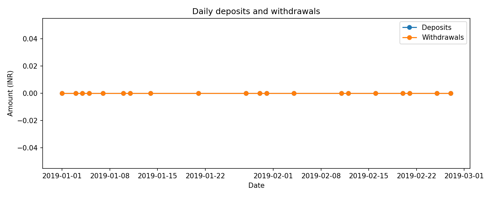

<!DOCTYPE html>
<html lang="en">
<head>
    <meta charset="UTF-8">
    <meta name="viewport" content="width=device-width, initial-scale=1.0">
    <title>Bank Statement Analysis - CPC Hiring Assignment</title>
</head>
<body>

<h1>🏦 Bank Statement Analysis - CPC Hiring Assignment</h1>

<h2>📌 Project Objective</h2>

The objective of this project is to build a <b>robust data extraction and analysis tool</b> that can:

<ul>
    <li>Extract structured information from PDF bank statements (HDFC and ICICI).</li>
    <li>Parse and standardize transactions into CSV files.</li>
    <li>Apply analysis rules to <b>flag suspicious or high-value transactions</b>.</li>
    <li>Generate a <b>summary report (PDF)</b> and <b>visualization</b> for insights.</li>
</ul>

This solution automates manual data entry and supports <b>financial investigators</b> in quickly identifying key patterns and anomalies.

<h2>📂 Project Structure</h2>
<pre>
bank-statement-analysis/
│── bank_statement_extractor.py
│── requirements.txt
│── HDFC.pdf
│── ICICI.pdf
│── output_HDFC/
│   ├─ account_info.csv
│   ├─ transactions.csv
│   ├─ report.pdf
│── output_ICICI/
│   ├─ account_info.csv
│   ├─ transactions.csv
│   ├─ timeline.png
│   ├─ report.pdf
│── README.md
</pre>

<h2>🛠️ Tools & Technologies</h2>
<ul>
    <li><b>Programming Language:</b> Python 3.10</li>
    <li><b>Libraries:</b>
        <ul>
            <li>pdfplumber → extract text from PDFs</li>
            <li>camelot-py → extract structured tables from PDFs</li>
            <li>pandas, numpy → data preprocessing & manipulation</li>
            <li>matplotlib → visualization (timeline plot)</li>
            <li>reportlab → generate summary PDF report</li>
        </ul>
    </li>
    <li><b>Environment:</b> VS Code / Anaconda</li>
    <li><b>Version Control:</b> Git & GitHub</li>
</ul>

<h2>📊 Methodology</h2>
<ol>
    <li><b>PDF Data Extraction</b>
        <ul>
            <li>Extract account information (account number, IFSC, MICR, holder name, etc.)</li>
            <li>Parse transaction tables into standardized columns:
                <ul>
                    <li>transaction_date</li>
                    <li>description</li>
                    <li>withdrawal_amount</li>
                    <li>deposit_amount</li>
                    <li>balance</li>
                </ul>
            </li>
        </ul>
    </li>
    <li><b>Transaction Analysis & Flagging</b>
        <ul>
            <li>DD Large Withdrawal: Identify withdrawals &gt; ₹10,000 via Demand Draft (DD).</li>
            <li>RTGS Large Deposit: Flag deposits &gt; ₹50,000 via RTGS.</li>
            <li>Entity Check: Flag transactions with entities “Guddu”, “Prabhat”, “Arif”, or “Coal India”.</li>
        </ul>
    </li>
    <li><b>Visualization</b>
        <ul>
            <li>Create a <b>timeline plot</b> for ICICI statements showing withdrawals vs deposits.</li>
        </ul>
    </li>
    <li><b>Report Generation</b>
        <ul>
            <li>Auto-generate <code>report.pdf</code> (max 3 pages, font Times 11pt) containing:
                <ul>
                    <li>Methodology</li>
                    <li>Account details</li>
                    <li>Summary of flagged transactions</li>
                    <li>Visualization</li>
                </ul>
            </li>
        </ul>
    </li>
</ol>

<h2>📈 Key Results</h2>
<ul>
    <li>Successfully extracted account and transaction details from <b>HDFC</b> and <b>ICICI</b> sample statements.</li>
    <li>Generated <b>standardized CSV files</b> with clean, structured data.</li>
    <li>Implemented <b>flagging rules</b> to highlight suspicious transactions.</li>
    <li>Created a <b>timeline chart</b> for ICICI deposits & withdrawals.</li>
    <li>Produced <b>summary reports</b> for both statements.</li>
</ul>

<h2>📌 Features</h2>
<ul>
    <li>Works with both <b>HDFC</b> and <b>ICICI</b> bank statements.</li>
    <li>Extracts <b>account details</b> and <b>transactions</b> into CSV.</li>
    <li>Flags transactions that meet suspicious criteria.</li>
    <li>Generates <b>visual insights</b> (timeline plot).</li>
    <li>Creates a <b>PDF report</b> with methodology and findings.</li>
</ul>

<h2>🚀 How to Run Locally</h2>
<ol>
    <li>Clone the repository
        <pre>git clone https://github.com/yourusername/bank-statement-analysis.git
cd bank-statement-analysis</pre>
    </li>
    <li>Create & activate virtual environment
        <pre>python -m venv venv
# Activate:
venv\Scripts\activate        # Windows
source venv/bin/activate     # Mac/Linux</pre>
    </li>
    <li>Install dependencies
        <pre>pip install -r requirements.txt</pre>
    </li>
    <li>Run the script</li>
    
For ICICI statement:

    <pre>python bank_statement_extractor.py --pdf "ICICI.pdf" --outdir output_ICICI --name "Pratik Sutar" --email "pratik@example.com"</pre>
    
For HDFC statement:

    <pre>python bank_statement_extractor.py --pdf "HDFC.pdf" --outdir output_HDFC --name "Pratik Sutar" --email "pratik@example.com"</pre>
</ol>

<h2>📂 Output Files</h2>
<ul>
    <li>account_info.csv → account details (account number, holder name, IFSC, MICR, etc.)</li>
    <li>transactions.csv → structured transactions with flags:
        <ul>
            <li>flag_DD_large_withdrawal</li>
            <li>flag_RTGS_large_deposit</li>
            <li>flag_entities</li>
        </ul>
    </li>
    <li>timeline.png → deposits vs withdrawals plot (only for ICICI)</li>
    <li>report.pdf → summary report with methodology, flagged transactions, and visualization</li>
</ul>

Example: ICICI Timeline Plot

Example: Report PDF

  <a href="https://github.com/pratiksutar841/CPC-ANALYTICS---Assignment-/blob/b80847e8920af75986efdc1c492eca1274f9c3b4/output_ICICI/report.pdf" target="_blank">
    Click here to view the Report PDF
  </a>

<h2>🙋‍♂️ Author</h2>

Pratik Prashant Sutar 
B.Tech in Computer Science & Engineering (Data Science)

<ul>
    <li>GitHub: <a href="https://github.com/pratiksutar841">pratiksutar841</a></li>
    <li>LinkedIn: <a href="https://www.linkedin.com/in/pratik-sutar">Pratik Sutar</a></li>
</ul>

</body>
</html>
